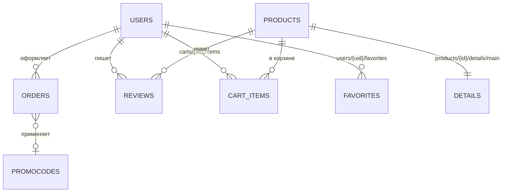

# NEXUS store — интернет-магазин электроники на Firebase

**Сайт:** https://djxjdjxxjxjx6-collab.github.io/nexus-store/ · **Код сайта:** папка [`nexus-store/`](nexus-store/)

Полнофункциональное веб-приложение: каталог с поиском, фильтрами и пагинацией, карточка товара с отзывами, корзина и оформление заказа, личный кабинет с историей в реальном времени и админ-панель.

**Стек:** Vanilla JavaScript (ES6-модули), HTML5, CSS3 (адаптивная вёрстка, светлая/тёмная тема), Firebase Authentication, Cloud Firestore, Firestore Security Rules. Хостинг — GitHub Pages.

## Страницы

| Файл | Назначение |
|---|---|
| `index.html` | Витрина (промо, категории со счётчиками, хиты продаж) + каталог: пагинация «Показать ещё» (по 12), поиск по названию/бренду/тегам через Firestore, фильтры (категория, «со скидкой», диапазон цен), 5 сортировок, real-time появление новых товаров, недавно просмотренные |
| `product.html` | Карточка: описание, характеристики, отзывы и оценки (с пагинацией), похожие товары (с пагинацией), «В корзину / Купить / В избранное», live-обновление цены и остатка |
| `cart.html` | Корзина: изменение количества, удаление, промокоды, бесплатная доставка от 50 000 ₸, оформление заказа (транзакция) → заказ переходит в историю |
| `profile.html` | Личный кабинет: обзор, история заказов с live-статусами и таймлайном, отмена и повтор заказа, мои отзывы (редактирование/удаление), избранное, профиль и настройки, смена пароля |
| `admin.html` | Админ-панель (только роль `admin`): дашборд со статистикой, CRUD товаров, все заказы (real-time, смена статусов, экспорт CSV), пользователи и назначение ролей, модерация отзывов, промокоды |
| `auth.html` | Регистрация, вход («запомнить меня»), восстановление пароля |
| `404.html` | Страница «не найдено» / офлайн-заглушка |

**Во всех страницах:** живой поиск с подсказками в шапке (клавиша `/`), колокольчик со статусами заказов в реальном времени, счётчик корзины, светлая/тёмная тема, мобильная нижняя навигация, PWA (установка на телефон, офлайн-кэш через Service Worker).

## Схема базы данных (Cloud Firestore)



### `users/{uid}` — пользователи
| Поле | Тип | Описание |
|---|---|---|
| name, email, phone, city, address | string | Профиль |
| role | `"user"` \| `"admin"` | Роль (по умолчанию `user`) |
| settings | map `{ newsletter: bool, theme: "auto"\|"light"\|"dark" }` | Настройки |
| ordersCount, totalSpent | number | Денормализованные счётчики (обновляются в транзакции заказа) |
| createdAt, lastOrderAt | timestamp | |

Подколлекция `users/{uid}/favorites/{productId}` — избранное (копия name, price, emoji, image…).

### `products/{productId}` — основные сущности (каталог)
| Поле | Тип | Описание |
|---|---|---|
| name, nameLower, brand, shortDesc | string | |
| category | string | `smartphones`, `laptops`, `tablets`, `audio`, `watches`, `gaming`, `photo`, `smarthome`, `accessories` |
| price, oldPrice | number | Цена и старая цена (для скидки) |
| onSale | bool | Есть скидка (для фильтра) |
| stock, salesCount | number | Остаток и продажи |
| ratingAvg, ratingCount, ratingSum | number | Денормализованный рейтинг |
| tags | array\<string\> | Теги |
| searchKeywords | array\<string\> | Префиксы слов для поиска (`array-contains`) |
| image, emoji, isNew | string / bool | Отображение |
| createdAt, updatedAt | timestamp | |

Подколлекция `products/{id}/details/main` — «тяжёлые» данные: `description` (string), `specs` (map). Загружаются только на странице товара — каталог получает лёгкие документы.

### `carts/{uid}/items/{productId}` — активные действия (корзина)
`productId, name, price, oldPrice, image, emoji, category, brand, qty, addedAt, updatedAt`

### `orders/{orderId}` — история действий (заказы)
| Поле | Тип | Описание |
|---|---|---|
| number | string | Номер `NX-XXXXXX` |
| userId, userName, userEmail | string | Покупатель (имя и e-mail продублированы для админки) |
| items | array\<map\> | `{ productId, name, price, qty, image, emoji, category }` — снимок товара на момент покупки |
| itemsCount, subtotal, discount, deliveryPrice, total | number | Суммы |
| promoCode | string \| null | |
| delivery | map | `{ name, phone, city, address, method, payment, comment }` |
| status | string | `new` → `processing` → `shipped` → `delivered` / `cancelled` |
| statusHistory | array\<map\> | `{ status, at, by }` |
| createdAt, updatedAt | timestamp | |

### `reviews/{productId}_{uid}` — отзывы и оценки
`productId, productName, userId, userName, rating (1–5), text, edited, createdAt, updatedAt` — ID документа гарантирует один отзыв на товар от пользователя.

### `promocodes/{CODE}` — промокоды
`percent, active, uses, createdAt`

## Firebase-функционал

- **Real-time (`onSnapshot`)**: первая страница каталога, карточка товара (цена/наличие/рейтинг), отзывы, корзина и счётчик в шапке, избранное, профиль/роль, заказы в личном кабинете (уведомление при смене статуса), все заказы и модерация в админке.
- **Пагинация**: курсорная (`startAfter` + `limit`) — каталог, похожие товары, отзывы, товары/пользователи/заказы/отзывы в админке.
- **Оптимизация**:
  - составные индексы — `firestore.indexes.json`;
  - «проекция» вместо `select()` (в Web SDK метода нет): лёгкие документы каталога + отдельный документ `details/main`;
  - денормализация: рейтинг в товаре, снимок товара в корзине/заказе/избранном, имя покупателя в заказе, название товара в отзыве, счётчики в профиле;
  - агрегатные запросы `getCountFromServer()` и `getAggregateFromServer(sum)` для статистики без загрузки документов;
  - оффлайн-кэш IndexedDB (`persistentLocalCache`);
  - транзакции (`runTransaction`) для заказа и рейтинга; `writeBatch` для товара + деталей;
  - резервные запросы с сортировкой на клиенте, пока индекс строится.
- **Security Rules** (`firestore.rules`): роли `user`/`admin`, пользователь не может менять себе роль, видит только свои заказы и корзину, может лишь отменить новый заказ, менять у товара только остаток (в меньшую сторону) и рейтинг; CRUD каталога, промокодов и статусов — только админ.

## Безопасность данных (валидация в правилах)

Кроме проверки ролей правила проверяют **типы и границы данных**: у товара — название 1–120 символов, цена ≥ 0, остаток — целое ≥ 0, категория из списка; у профиля — длина имени/телефона/адреса; у заказа — e-mail совпадает с токеном, 1–50 позиций, сумма ≥ 0; у корзины — количество 1–99 и совпадение ID товара с путём.

## Запуск локально

```bash
npx serve .        # или любой статический сервер
```
Конфигурация проекта Firebase — `js/firebase-config.js`. Правила и индексы: `firebase deploy --only firestore`.

## Структура

```
├── index.html, product.html, cart.html, profile.html, admin.html, auth.html, 404.html
├── manifest.webmanifest, sw.js, img/   # PWA
├── css/style.css
├── js/
│   ├── firebase-config.js
│   ├── sdk/            # ре-экспорт Firebase SDK (CDN)
│   ├── core/           # firebase.js, config.js, session.js (auth+роли), ui.js, actions.js
│   ├── db/             # слой данных: products, cart, orders, reviews, users, seed
│   └── pages/          # логика страниц
├── firestore.rules
├── firestore.indexes.json
└── firebase.json
```
